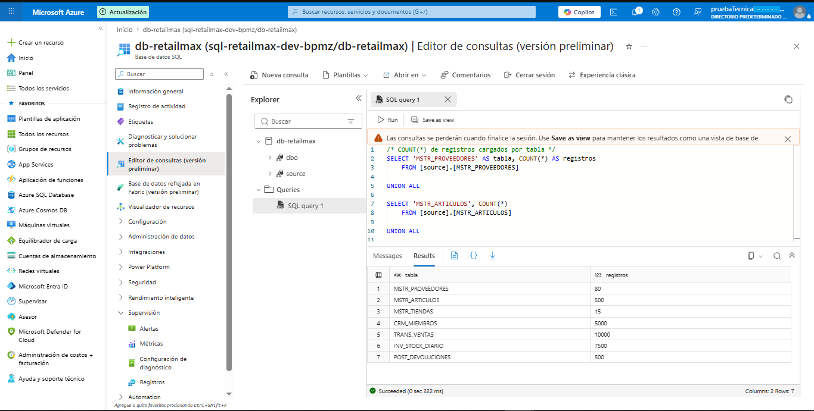
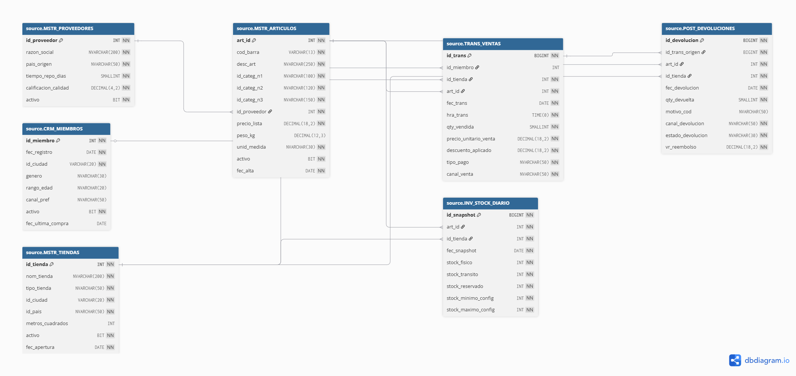

# Fase 1 — Generación y carga de datos de origen

## Objetivo

Construir las siete tablas relacionales que actuarán como fuente de
origen del pipeline de RetailMax.

Los datos dummy se generan mediante Python, utilizando una semilla
aleatoria fija y parámetros configurables desde un archivo YAML.

Los resultados se exportan en los formatos CSV y Parquet y posteriormente
se cargan en Azure SQL Database.

## Tablas generadas

Las tablas de origen son:

1. MSTR_PROVEEDORES
2. MSTR_ARTICULOS
3. MSTR_TIENDAS
4. CRM_MIEMBROS
5. TRANS_VENTAS
6. INV_STOCK_DIARIO
7. POST_DEVOLUCIONES

## Volúmenes objetivo

Los volúmenes objetivo definidos para el caso son:

| Tabla | Registros objetivo |
|---|---:|
| MSTR_PROVEEDORES | 800 |
| MSTR_ARTICULOS | 5,000 |
| MSTR_TIENDAS | 150 |
| CRM_MIEMBROS | 50,000 |
| TRANS_VENTAS | 1,000,000 |
| INV_STOCK_DIARIO | 750,000 |
| POST_DEVOLUCIONES | 50,000 |

## Volúmenes utilizados en la validación

Para validar funcionalmente la generación y la carga en Azure SQL se
utilizó el siguiente perfil reducido:

| Tabla | Registros cargados |
|---|---:|
| MSTR_PROVEEDORES | 80 |
| MSTR_ARTICULOS | 500 |
| MSTR_TIENDAS | 15 |
| CRM_MIEMBROS | 5,000 |
| TRANS_VENTAS | 10,000 |
| INV_STOCK_DIARIO | 7,500 |
| POST_DEVOLUCIONES | 500 |

La validación de extremo a extremo se realizó con volúmenes reducidos
debido al tiempo de ejecución, las restricciones de recursos del entorno
local y el uso de una instancia gratuita de Azure SQL Database.

La estructura de las tablas, las relaciones, las reglas de generación y
el flujo de carga se mantienen iguales para ambos perfiles.

Los volúmenes pueden modificarse desde:

`data-generation/config/generation_config.yaml`

## Generación de datos

Desde la carpeta `data-generation`, los datos se generan mediante:

```powershell
py -m src.main
```

Este comando:

1. Lee la configuración definida en el archivo YAML.
2. Genera las siete tablas de datos dummy.
3. Aplica las reglas de generación configuradas.
4. Exporta los resultados en CSV y Parquet.

Los archivos se generan en:

```text
data-generation/output/csv/
data-generation/output/parquet/
```

Los archivos de salida se mantienen fuera del repositorio mediante
`.gitignore`, ya que pueden volver a generarse utilizando el código
y la configuración entregados.

## Creación de las tablas en Azure SQL

El script SQL utilizado para crear el esquema `source`, las siete tablas,
sus claves primarias y sus claves foráneas se encuentra en:

```text
data-generation/sql/create_source_tables.sql
```

El script debe ejecutarse antes de realizar la primera carga de datos.

## Carga de datos en Azure SQL

Desde la carpeta `data-generation`, la carga se ejecuta mediante:

```powershell
py -m src.load_to_azure_sql
```

El cargador realiza las siguientes operaciones:

1. Establece la conexión con Azure SQL Database.
2. Limpia los registros de cargas anteriores.
3. Lee los siete archivos CSV.
4. Inserta los registros respetando el orden de dependencia de las tablas.
5. Confirma las transacciones realizadas.
6. Cierra la conexión con la base de datos.

Las credenciales de conexión se leen desde un archivo `.env` local.

El archivo `.env` no se incluye en el repositorio. Como referencia para
la configuración se entrega el archivo:

```text
.env.example
```

## Resultado de la carga

La carga funcional finalizó correctamente con los siguientes conteos:

| Tabla | Registros cargados |
|---|---:|
| MSTR_PROVEEDORES | 80 |
| MSTR_ARTICULOS | 500 |
| MSTR_TIENDAS | 15 |
| CRM_MIEMBROS | 5,000 |
| TRANS_VENTAS | 10,000 |
| INV_STOCK_DIARIO | 7,500 |
| POST_DEVOLUCIONES | 500 |

Los conteos fueron validados directamente en Azure SQL mediante una
consulta `SELECT COUNT(*)` sobre cada tabla.

## Evidencia de carga

La siguiente captura muestra el resultado de los conteos ejecutados
directamente en Azure SQL Database:



## Modelo entidad-relación

El siguiente diagrama representa las siete tablas del esquema `source`,
sus claves primarias y las relaciones establecidas mediante claves
foráneas:



Las principales relaciones son:

- Un proveedor puede suministrar varios artículos.
- Un miembro puede estar asociado con varias ventas.
- Una tienda puede registrar varias ventas.
- Un artículo puede aparecer en varias ventas.
- Una tienda y un artículo pueden tener varios registros de inventario.
- Una venta puede originar una o varias devoluciones.

## Reproducibilidad

La generación utiliza una semilla aleatoria fija, por lo que una ejecución
con la misma configuración produce nuevamente los mismos datos y
volúmenes.

Para cambiar los volúmenes únicamente es necesario modificar:

```text
data-generation/config/generation_config.yaml
```

y volver a ejecutar:

```powershell
py -m src.main
```

## Mejora técnica pendiente

La carga de los volúmenes objetivo puede optimizarse utilizando:

- Inserciones por lotes.
- `cursor.fast_executemany = True`.
- Un tamaño de lote configurable.
- Confirmación de transacciones por tabla.

Esta mejora permitiría reducir el tiempo de carga de las tablas con mayor
volumen sin modificar el modelo relacional ni las reglas de generación.

## Estado de la Fase 1

La Fase 1 incluye los siguientes elementos:

- [x] Script de generación de datos dummy.
- [x] Semilla aleatoria fija.
- [x] Parámetros configurables mediante YAML.
- [x] Exportación en CSV y Parquet.
- [x] Script SQL de creación de las tablas.
- [x] Script Python de carga en Azure SQL.
- [x] Diagrama Entidad-Relación de las siete tablas.
- [x] Evidencia de carga mediante `SELECT COUNT(*)`.

Con estos elementos se completa el Entregable 1 de la prueba técnica.